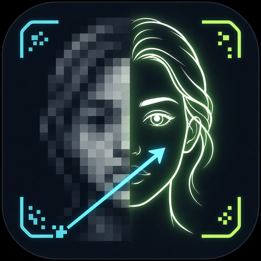
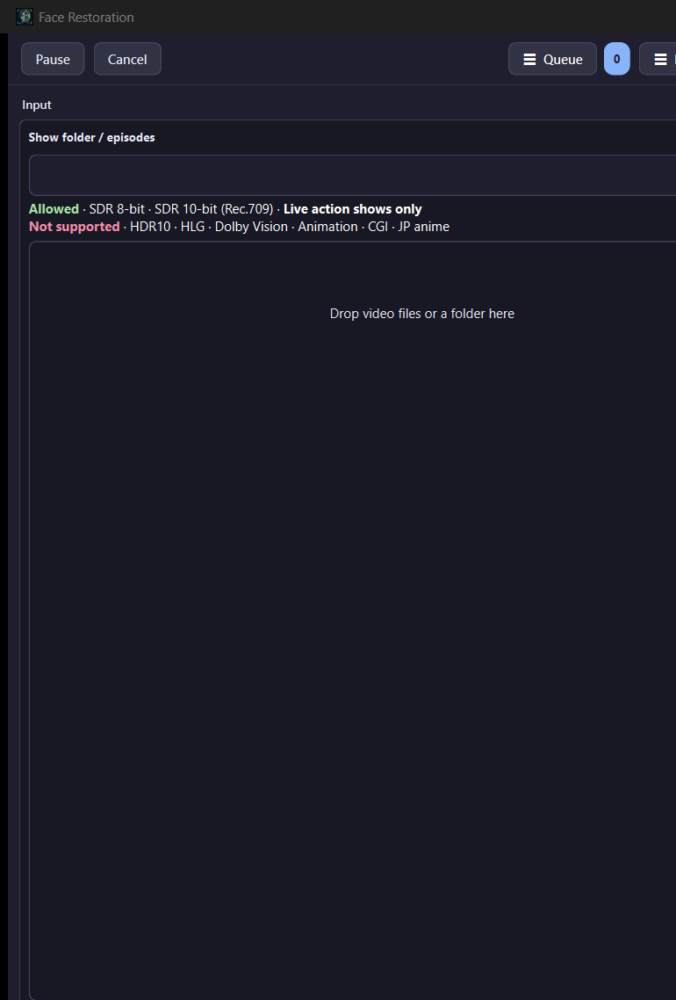
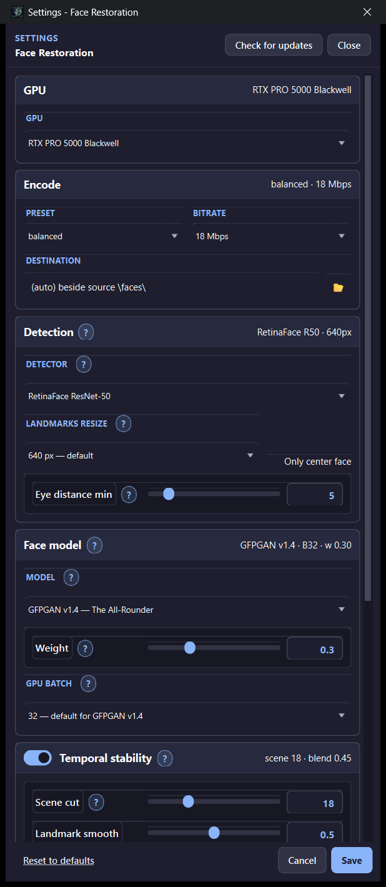

# Face Restoration

  

  
  
  
  

---

## What is Face Restoration? (plain English)

**Face Restoration finds faces in a video and cleans them up** — softer film grain on skin, sharper eyes/mouth, less mushy compression on close-ups — then writes a new video with those faces blended back in.

You drop episodes in, click **Start**, and walk away. Defaults are already tuned (CodeFormer / GFPGAN family, temporal stability on). Output lands in a `\faces\` folder next to your source.

**Only live-action SDR** (Rec.709 8/10-bit). **Not** for HDR10 / HLG / Dolby Vision, and **not** for animation / CGI / JP anime (wrong kind of faces for these models).

### What happens to each file

| Step | In plain words |
|------|----------------|
| **Detect** | Find faces each frame (RetinaFace by default). |
| **Restore** | Run an AI model on each face crop (GFPGAN, CodeFormer, GPEN, …). |
| **Blend** | Paste restored faces back with temporal smoothing so they don’t flicker. |
| **Encode** | Write a new video on the GPU; audio/subs stay with the remux. |

Models download once on first open. Crops batch through the GPU for speed.

---

## Screenshots

  

<em>Main window — drop live-action SDR episodes, queue, Start.</em>

  

<em>Settings — GPU, encode, detector, face model, temporal stability.</em>

---

## How to use (quick start)

1. Install from [Releases](https://github.com/aberthil/FaceRestoration-releases/releases/latest) and open **Face Restoration**.  
2. Wait if models are still downloading (first open).  
3. **Browse** or **drag-and-drop** SDR live-action videos / a show folder.  
4. Optional: **Settings** → pick model (GFPGAN / CodeFormer / …) and encode bitrate.  
5. **+ Add to Queue** → **Start**.  
6. Finished files appear under `\faces\` beside the source.

---

## Download

| | |
|--|--|
| **Latest Setup** | [FaceRestoration-1.0.14-Setup.exe](https://github.com/aberthil/FaceRestoration-releases/releases/latest/download/FaceRestoration-1.0.14-Setup.exe) |
| **All versions** | [Releases](https://github.com/aberthil/FaceRestoration-releases/releases) |
| **SHA-256** | [FaceRestoration-1.0.14-Setup.exe.sha256](https://github.com/aberthil/FaceRestoration-releases/releases/latest/download/FaceRestoration-1.0.14-Setup.exe.sha256) |

> Prefer the **latest** tag always:  
> https://github.com/aberthil/FaceRestoration-releases/releases/latest

Installs to `C:\DolbyVisionScripts\FaceRestoration` by default. Settings / Pushover / queue live in AppData and **survive App Update**.

---

## Requirements

| | |
|--|--|
| OS | Windows 10/11 **x64** |
| GPU | **NVIDIA** CUDA (RTX recommended; VRAM depends on model / batch) |
| Input | **SDR** live-action only — not HDR, not animation/CGI/anime |
| Disk | Setup + CUDA venv (created during install) + model weights (first open) |

---

## Models (when you care)

| Model | Vibe |
|-------|------|
| **CodeFormer** | Balanced default |
| **GFPGAN v1.4** | Fast all-rounder |
| **GPEN** | Softer / more natural skin |
| **RestoreFormer++** | Extra facial detail |
| **VQFR / DiffBIR** | Heavy repair (much slower) |

---

## What's New

### v1.0.14

See [Releases](https://github.com/aberthil/FaceRestoration-releases/releases) for each Setup’s notes.

---

## Links

- **Latest download:** https://github.com/aberthil/FaceRestoration-releases/releases/latest  
- **This repo:** public Setup hosting + project page (source stays private)

---

## License / support

Windows installers for end users. Problems with a specific Setup: note the release tag and contact the publisher (`aberthil`).
